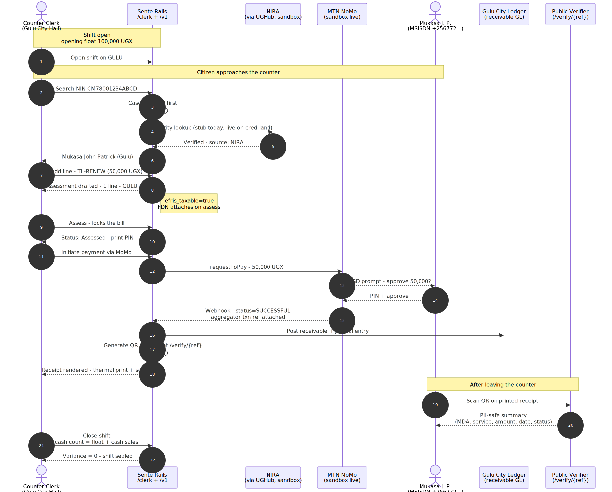
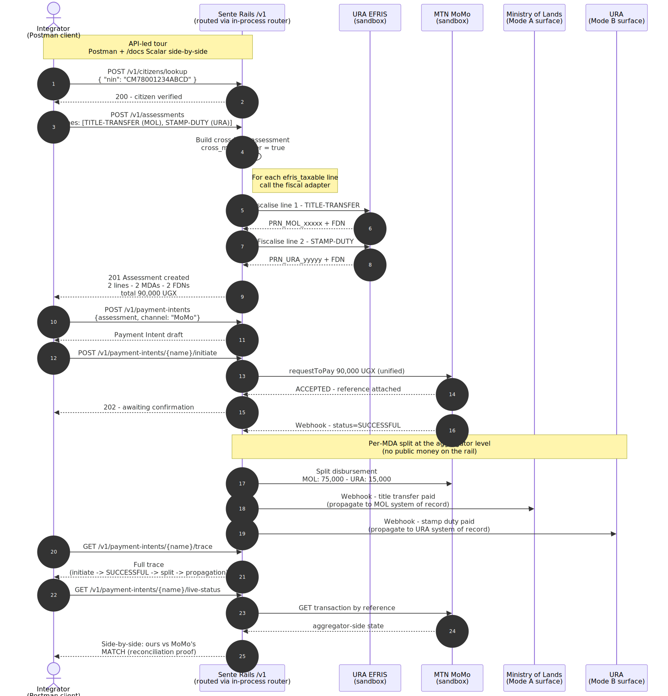
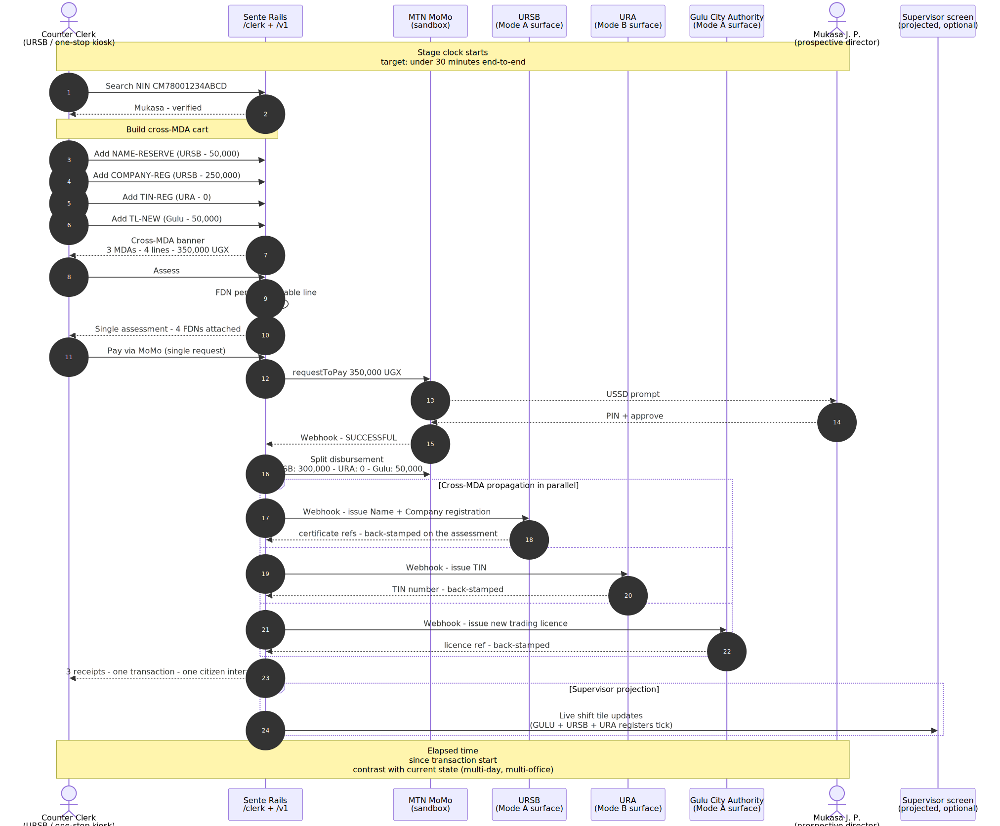

<!--
─────────────────────────────────────────────────────────────────────────────
Copyright (c) 2026 Geoffrey Oketwangwu (asatlabs.org)
Author:  Geoffrey Oketwangwu <geoffreyoketwangwu@gmail.com>

CONFIDENTIAL AND PROPRIETARY

This source file is the original work of Geoffrey Oketwangwu and contains
confidential, proprietary information protected under copyright and trade-
secret law. No part may be reproduced, distributed, modified, reverse-
engineered, or used — in source or compiled form — without the prior
written permission of the author.

All rights reserved.
-->
# Sente Rails — Program Brief

**Government Revenue Infrastructure for Uganda**

| | |
|---|---|
| **Maintainer** | Geoffrey Oketwangwu — ASAT LABS, Gulu |
| **Live sandbox** | https://sente-rails.space |
| **Source code** | https://github.com/asatlabs/sente-rails |
| **License** | Proprietary — All Rights Reserved |

---

## 1. Executive summary

Uganda's public-revenue collection landscape is fragmented across forty-plus Ministries, Departments, Authorities and eleven post-2020 cities. Each operates its own counter platform, its own ledger, its own reconciliation cycle. Where MDAs do connect, integrations are point-to-point, vendor-owned, expensive to extend, and opaque to the oversight bodies that need to audit them.

**Sente Rails is sovereign government revenue infrastructure for Uganda.** It collects, fiscalises, reconciles, and propagates citizen transactions across MDAs and Local Governments — composably, by API, never holding public money. The codebase is proprietary and Ugandan-owned, self-hosts on the NITA-U sovereign government cloud, and is designed so a new MDA can be onboarded in fourteen days from a signed Memorandum of Understanding.

The program rests on three pillars:

- **Sovereignty.** Ugandan-owned and Ugandan-operated, with no per-seat licensing and no foreign vendor on the critical path. The source is proprietary, but open to authorised government review under controlled, read-only access — the rail can be audited end-to-end without the IP leaving Ugandan hands. Sovereignty without foreign dependency.
- **Composability.** MDAs don't need another monolith. Sente Rails delivers primitives — counter, ledger, receipt, reconcile, propagate — that wire into existing systems via UGHub, URA EFRIS, NIRA, and the major mobile-money aggregators.
- **Velocity.** Fourteen days from signed MoU to live revenue counter. This is a quantitative claim the architecture is engineered to make true; §6 of this brief explains how.

Today the rail is live in sandbox at https://sente-rails.space with a counter clerk app (`/clerk`), supervisor dashboard (`/supervisor`), public receipt verifier (`/verify/{ref}`), an OpenAPI-3.1-documented `/v1` API surface across twenty-two endpoints, and an API workbench that maps every catalogued government entity in real time. Forty-six Ugandan government entities sit on the rail across twenty-six functional sectors. Five have integrations in active sandbox; thirty-seven are sequenced behind credential or MoU gates; four are in formal inquiry as Mode C oversight consumers.

---

## 2. Architecture

### 2.1 Three interaction modes

Every government entity Sente Rails touches falls into one of three modes:

- **Mode A — System of Record.** Sente Rails *is* the MDA's counter platform. We hold the canonical record of every transaction. Used today by city authorities (Gulu, Lira) and intended for any of the eleven post-2020 cities or sub-county-level entities that lack existing revenue systems.
- **Mode B — Integration / Orchestration.** The MDA has its own system; Sente Rails calls its APIs. This is the path for URA (EFRIS), NIRA (identity, via UGHub), URSB (business registration), NSSF (contributions), and the mobile-money aggregators. We are the orchestrator, not the system of record.
- **Mode C — Oversight Read Consumer.** OAG, MoFPED, UBOS, and the Local Government oversight ministry read aggregate or itemised data scoped to their statutory remit. They never collect on behalf of any MDA.

This taxonomy is load-bearing. It lets every government entity, regardless of its current digital maturity, find its place on the rail without forcing a one-size-fits-all rewrite. A city with paper books today is Mode A and onboards directly. A ministry with an existing platform is Mode B and the integration sits behind a single adapter. An oversight body is Mode C and gets read access without operational dependency.

### 2.2 The layered rail (Figure 1)

The rail is built in six layers, each independently replaceable:

- **Edge** — public HTTPS, nginx, Let's Encrypt, security headers, rate limit, edge admin-block.
- **Gateway** — authentication, idempotency keys, immutable audit log, in-process router.
- **API** — the `/v1` surface; twenty-two endpoints across seven modules; OpenAPI 3.1 spec at `/api-explorer`; integrator developer hub at `/docs`.
- **Domain** — Citizen, MDA, Service, Assessment, Counter Shift, Payment Intent, Payment Event.
- **Persistence** — MariaDB single-tenant per site, Redis for cache and queue, off-site backup.
- **Integrations** — adapter pattern with fiscal / payment / identity / gateway dispatchers. EFRIS, MoMo, Airtel, NIRA, UGHub stubs are in repo today; live swap is a one-attribute change.

### 2.3 Data primitives

The data model is deliberately minimal, and **cross-MDA in one transaction is a first-class behaviour, not a special case** — that is how a cross-MDA business registration (across URSB, URA, and Gulu City) compresses thirty minutes into a single counter interaction. *(The detailed data model is withheld from this disclosure build; it resides in the private development repository.)*

### 2.4 Integration map (Figure 3)

The rail sits between citizens at the counter, the aggregator network (mobile-money, card, bank), the fiscalisation track (EFRIS), and the oversight consumers. Each side of the rail is interchangeable: a new aggregator is a new adapter; a new MDA is a new catalogue entry plus an adapter when needed; a new oversight body is a new Mode C scope.

---

## 3. The no-public-money posture

**Sente Rails never holds public money.** This is the architectural answer to the Public Finance Management Act 2015 §43.

When a citizen pays at a Sente Rails counter, the money flows directly from the citizen's mobile wallet (or card, or bank) to a licensed payment aggregator on a per-MDA payable account. Sente Rails records the transaction in a receivable-only general ledger and propagates a receipt plus a webhook to each MDA's system of record. We are a fiscal *router*, never a *holder*.

The aggregator-level split means cross-MDA transactions settle into separate aggregator accounts in real time. There is never a single Sente Rails wallet that accumulates revenue. The architecture makes the Treasury Single Account discipline easier to enforce, not harder.

---

## 4. Integration story

| Tier | Count | What it means today |
|---|---|---|
| **Sandbox** | 5 | Adapter built, credentials active or in flight. URA-EFRIS, NIRA (via UGHub), MTN MoMo, NITA-U gateway adapter, Gulu City counter end-to-end. |
| **Planned** | 37 | Roadmap-committed. Adapter pattern means each is a ~14-day exercise once an MoU and credentials land. Includes all eleven post-2020 cities, sectoral ministries (Health, Education, Trade, ICT, Lands, Water, Transport, Agriculture, Tourism, Justice), authorities (NSSF, UNBS, UNEB, UCC, NWSC, NEMA, UNRA, UWA, NDA, PPDA), and the Local Government oversight ministry. |
| **Inquiry** | 4 | Mode C consumers: OAG, MoFPED, UBOS, plus UTB exploratory. |
| **Live** | 0 | No MDA passes real public-revenue traffic yet — rollout is gated per agency on credentials and signed MoUs. MTN MoMo sandbox is live but is a payment aggregator, not an MDA. URA-EFRIS moves to Live on the day sandbox credentials are granted (application in flight). |

The catalogue is reproducible from a single seed patch in the repository, so any clean install lands with the full forty-six-entity map and the same status taxonomy. Three reference workflows exercise the rail end-to-end: a Gulu trading-licence renewal (Figure 4), a Lands title-transfer with EFRIS PRN generation (Figure 5), and a cross-MDA business registration that closes in under thirty minutes (Figure 6).

---

## 5. Compliance posture

Seven Ugandan regulatory frameworks fall within scope. Each is addressed in the architecture by design, not retrofit. The full mapping is in the attached compliance matrix; the highlights:

- **Personal Data and Privacy Act 2019** — consent metadata on every Citizen record; NIN out of URLs and document names; per-purpose consent on the roadmap; right-to-erasure honoured via soft-archive.
- **Tax Procedures Code Act 2014 §73A–B** — EFRIS adapter for every fiscally-taxable service; per-line FDN; sandbox round-trip demonstrated end-to-end.
- **Public Finance Management Act 2015 §43** — no-public-money posture as described in §3.
- **e-Government Interoperability Framework** — API-first, OpenAPI 3.1, REST + JSON, UGHub-integration scaffolded.
- **Access to Information Act 2005** — OAG-scoped read APIs (Mode C), aggregate statistics open by default.
- **Computer Misuse Act 2011** — auth logs immutable, rate limit at the edge, intrusion detection planned for production hardening.
- **National Payment Systems Act 2020** — all payment processing via licensed aggregators; no direct money-handling at any point in the rail.

---

## 6. Roadmap & the velocity claim

### Next 90 days
- Credentials landed for URA-EFRIS and Airtel sandbox; first two MDAs move from Sandbox to Live.
- Letter of intent with Gulu City Authority (in motion); the trading-licence workflow moves to production traffic.
- Second city contracted; target is Mbarara, Lira, or Jinja.
- Production hardening: per-tenant TLS, off-site backup, audit log export, intrusion detection, formal penetration test.

### 14 days from MoU
The architecture is engineered so each new MDA is a configuration delta, not a code change. Onboarding workload breaks down as:

- **Day 1–3** — MoU finalised; credential request submitted; site provisioned on the sovereign cloud; catalogue stubbed.
- **Day 4–7** — services seeded (codes, fees, sectors, fiscal taxability); adapter configured if Mode B; integration smoke tested.
- **Day 8–10** — counter staff training; supervisor onboarded; receipt template tuned.
- **Day 11–14** — pre-launch validation; go-live with a controlled volume cap; observation period before opening to full traffic.

This is a quantitative commitment the architecture is built to honour, not an aspirational marketing line. The same patch that seeds the sandbox catalogue today is the patch that ships per-MDA on go-live.

### East African Community extensibility
The Country Profile primitive that pins Sente Rails to Uganda is per-country. Adding Kenya, Tanzania, Rwanda, Burundi or South Sudan is a Country Profile plus a per-country adapter library — no schema fork. Each EAC member can be onboarded as a new Country Profile and adapter library, extending the same proprietary rail under licence — no schema fork. The rail is designed for the region from day one.

---

## 7. Team & credentials

**ASAT LABS** is a Ugandan software studio based in Gulu, building software infrastructure for African public-sector use cases. **Geoffrey Oketwangwu** is the lead engineer and architect. The team's prior work includes a multi-city retail revenue platform (NXERP) currently in production with merchants in Uganda and beyond, and government data integration work that informed the Mode A/B/C taxonomy used here.

- **Email** — asatlabs@gmail.com
- **Web** — https://asatlabs.org
- **Live sandbox** — https://sente-rails.space
- **Source code** — https://github.com/asatlabs/sente-rails (proprietary; access by arrangement)

---

*This brief is a condensed read of the full architecture. The complete technical specification resides in the private development repository.*
